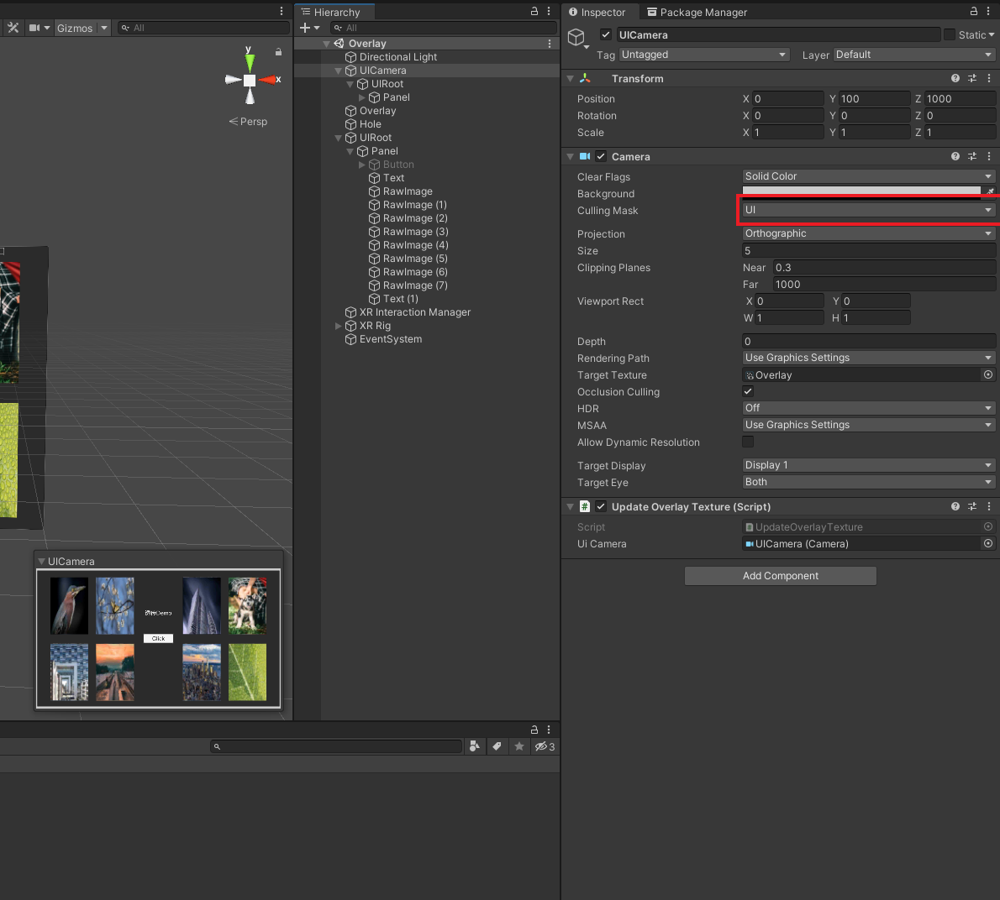
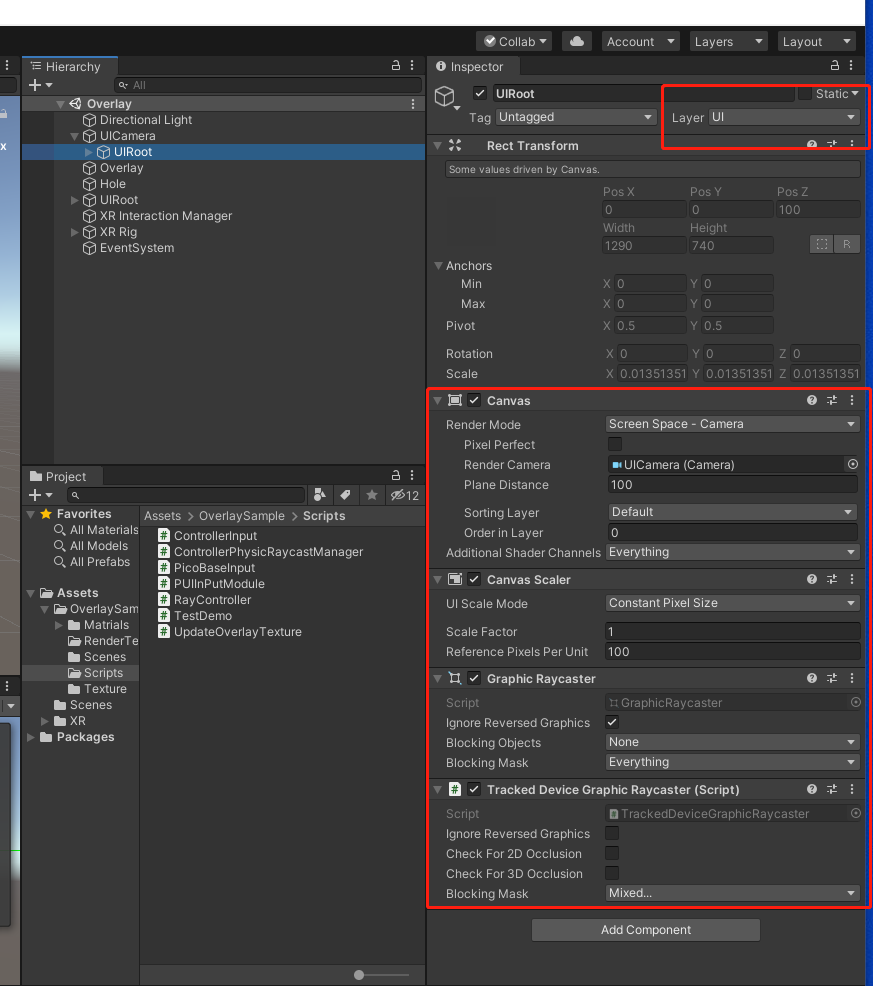
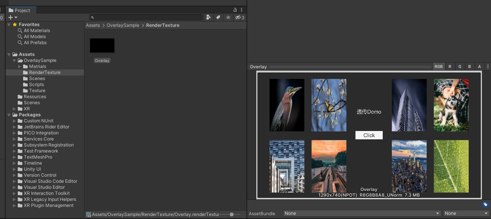
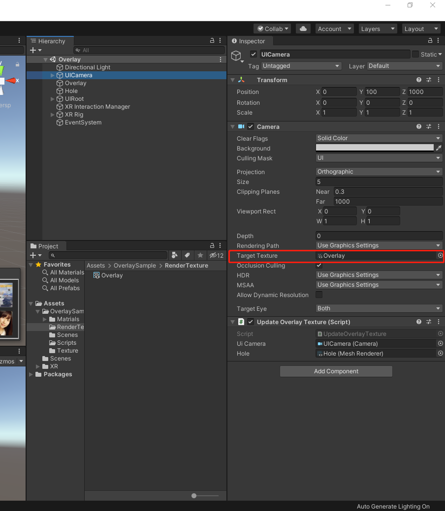
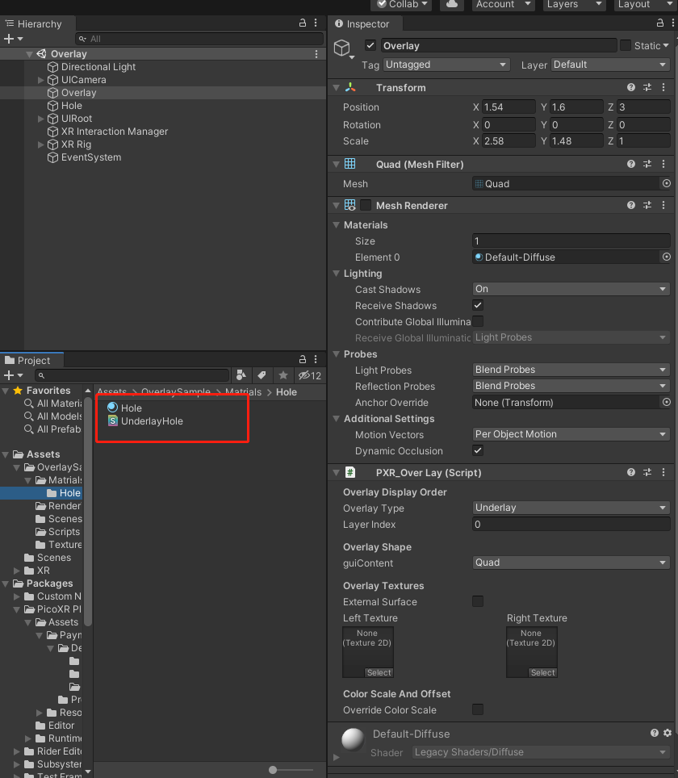
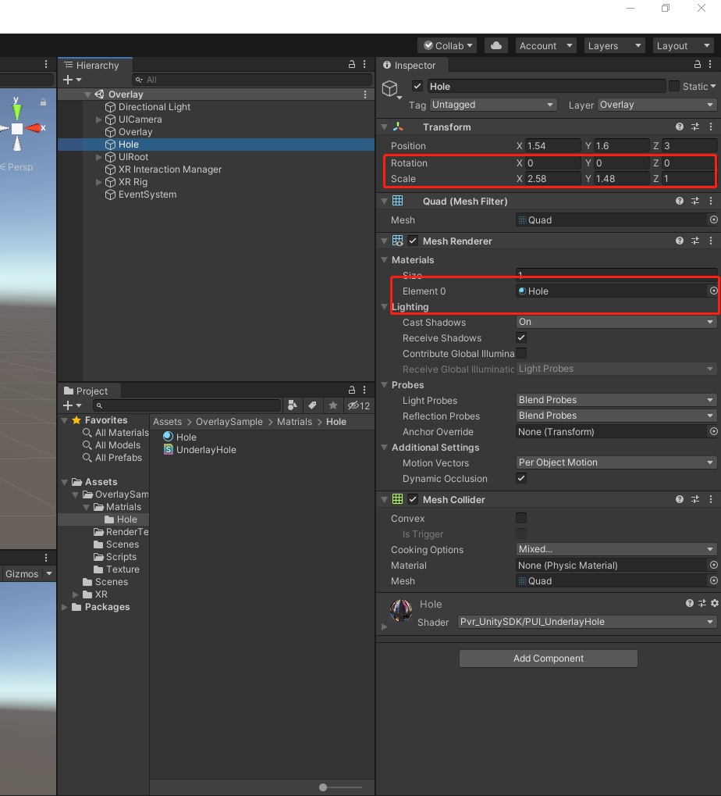
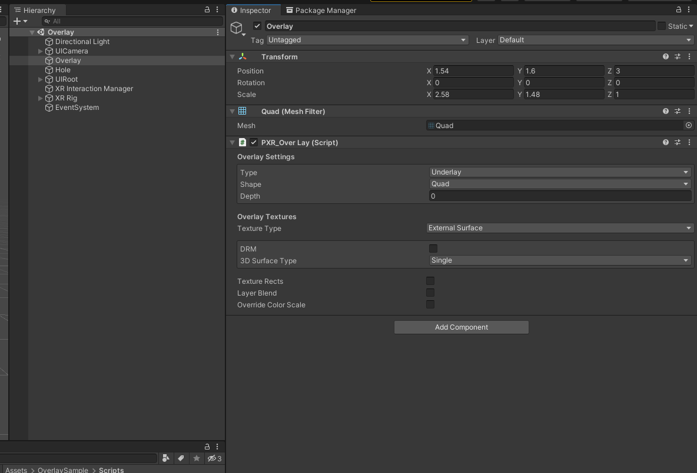
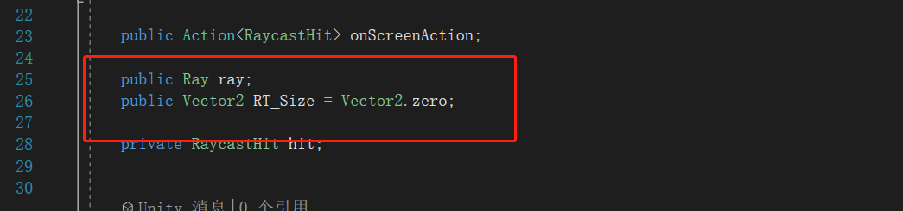
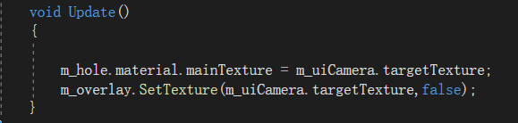

# Overlay-Demo-UnityXR

- If you have any questions/comments, please visit [**Pico Developer Answers**](https://devanswers.pico-interactive.com/) and raise your question there.

1. Create a Camera that is only used for UI rendering. And remove other camera from the UI layer. UI uses Unity’s default interactive class. It is shown as below:

   

   

2. Remove InputModule script within EventSystem, and add PUIInPutModule class and PicoBaseInput class as shown below:

   

3. Create a RenderTexture whose size must be big enough to display complete UI. Assign RenderTexture to the UICamera created.

   

   

4. Create a material which uses UnderlayHole.

   

5. Create a Quad named as Hole (or else). The scale and position of Hole are subject to actual needs, but its aspect ratio should be consistent with that of TargetTexture in UICamera. Assign UnderlayHole to Quad. 

   

6. Create a new Quad named as Overlay (or else). Uncheck Box Collider and Mesh Render, and add PXR_OverLay class in Overlay. Transform information should stay the same as Hole.

   

7. Assignment of the two parameters in ControllerPhysicRaycastManager class is necessary. The assignment for ray need to be updated per frame (normally the value is the direction of ray), and assign the Size of TargetTexture in UICamera to RT_Size, (i.e., Size of RenderTexture).

   

   Hole is the only detection object of rays, but detection codes  can be modified based on actual needs.

   

8. Update RenderTexture to Hole and Overlay per frame.

   

## Note:
- This demo is implemented in Unity 2020.3.36f1.

